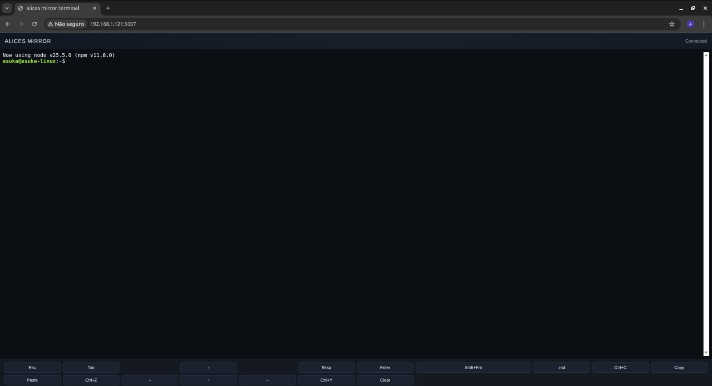
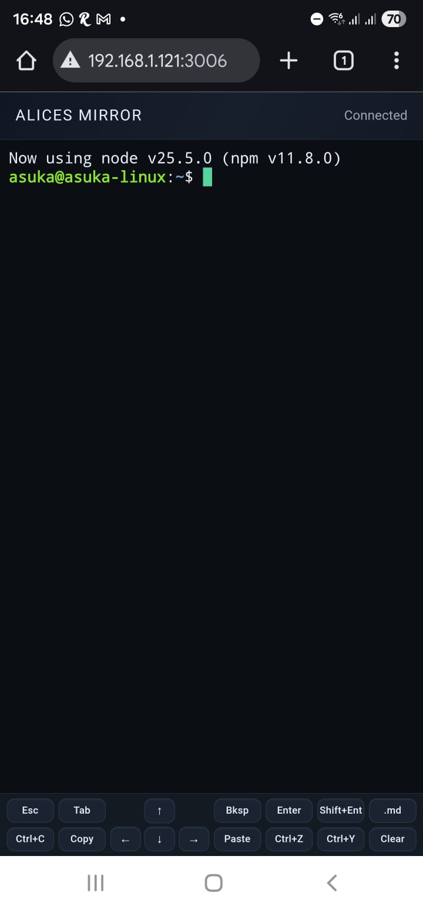

# Alice's Mirror

Serve a shared, persistent terminal over HTTP on your LAN with a mobile-friendly web UI.

<p align="center">
  
</p>
<p align="center">
  
</p>

## Status
- v2.0.0 (LAN discovery, daemon mode, shell reset, title integration)

## Highlights
- Shared, persistent PTY session over HTTP and WebSocket with multiple clients.
- Mobile-friendly UI with a key bar plus clipboard-aware copy and paste.
- The shell respawns if it exits, and the UI confirms exit, logout, Ctrl+D, or manual reset.
- Dynamic tab title with the current working directory and active command.
- Optional LAN discovery via mDNS and UDP broadcast (`--visible`).
- Run **Codex**, **Claude Code**, **OpenCode**, or any other CLI agent from any device.
- Works perfectly with **Cloudflare Tunnel** so you can reach your tools anywhere you want.

## AI Agent Workflows (References)
Alice's Mirror is just a terminal, so you can run the exact tools you already rely on:
- **Codex (codex)**
- **Claude Code (claude code)**
- **OpenCode (opencode)**
- Any other terminal-based agent or automation tool

This is the simplest way to take your Codex, Claude Code, and OpenCode workflows to any browser, on any device, in any place you want.

## Quickstart
1. Download the correct binary from GitHub Releases.
2. On Linux, make it executable: `chmod +x alices-mirror_linux`.
3. Run it on the host machine:
   - Linux: `./alices-mirror_linux`
   - Windows: `alices-mirror_windows.exe`
4. Open `http://<host-ip>:3002` in a browser.

You can close the browser, reopen it later, and even switch devices (desktop, phone, tablet). The terminal session stays the same. It is common to start an agent on your desktop, check progress from your phone while walking the dog, and then review the final state on a tablet before watching a movie.

If you want other devices on your LAN to connect, set the bind list to your host IP or to all interfaces:

```bash
./alices-mirror_linux --origin=0.0.0.0
```

## Installation
### From source
```bash
go build -o alices-mirror ./cli/alices-mirror
```

### Downloads
Prebuilt Linux and Windows binaries are published on the GitHub Releases page.

## Usage
Basic run:

```bash
./alices-mirror_linux
```

Start the shell in a specific directory:

```bash
./alices-mirror_linux --cwd=/var/www
```

Bind to specific LAN IPs:

```bash
./alices-mirror_linux --origin=127.0.0.1,192.168.1.50
```

Set a friendly alias for discovery and the UI title:

```bash
./alices-mirror_linux --alias="Studio Mac" --visible --origin=0.0.0.0
```

Enable Basic Auth:

```bash
./alices-mirror_linux --user=alice --password=secret
```

Disable auth entirely (not recommended on untrusted networks):

```bash
./alices-mirror_linux --yolo
```

Run in the background:

```bash
./alices-mirror_linux --daemon
```

Advertise on the LAN for discovery:

```bash
./alices-mirror_linux --visible --origin=0.0.0.0
```

Windows shell selection:

```powershell
alices-mirror_windows.exe --shell=powershell
```

## Configuration
There is no config file. Everything is controlled by flags:

- `-a, --alias=<name>` Set a friendly display name (used in UI title and LAN discovery).
- `-h, --help` Show help and exit.
- `-cw, --cwd=<path>` Start the shell in the specified working directory.
- `-d, --daemon` Run the server in the background (prints PID and URLs).
- `-o, --origin=<ip1,ip2,...>` Bind to comma-separated IPs/hosts (default `127.0.0.1,192.168.1.121`).
- `-P, --password=<password>` Set Basic Auth password (requires `--user`).
- `-p, --port=<port>` Listen on port (default `3002`).
- `-s, --shell=<shell>` Windows only: `powershell` or `cmd` (default `powershell`).
- `-u, --user=<user>` Set Basic Auth user (requires `--password`).
- `-vi, --visible` Advertise the server on the LAN for discovery.
- `-y, --yolo` Disable auth entirely when present.

## LAN Discovery
When `--visible` is set, the server announces itself via:
- mDNS service `_alices-mirror._tcp` on `local.`
- UDP broadcast JSON on port `3003` (every ~2 seconds)

Discovery payload fields:
- `type`, `id`, `alias`, `display_name`, `unique_name`
- `hosts`, `port`, `endpoints`, `protocol`
- `auth_required`, `auth_mode`, `yolo`
- `version`, `shell`, `os`, `cwd`, `hostname`

## Remote Access with Cloudflare Tunnel
Because Alice's Mirror is an HTTP application, the simplest and safest way to enable external access is to put it behind a **Cloudflare Tunnel**. A tunnel integrates cleanly with your application, exposes your local HTTP port over a secure route, and avoids opening inbound firewall ports.

If you want Codex, Claude Code, OpenCode, or any other terminal workflow to be available from anywhere you want, Cloudflare Tunnel is the recommended path.

## Platform Support
- Linux (shared Bash PTY)
- Windows (PowerShell or cmd via `--shell`)

## License
MIT. See `LICENSE`.

## Contributing
See `CONTRIBUTING.md`.

## Security
See `SECURITY.md`.
